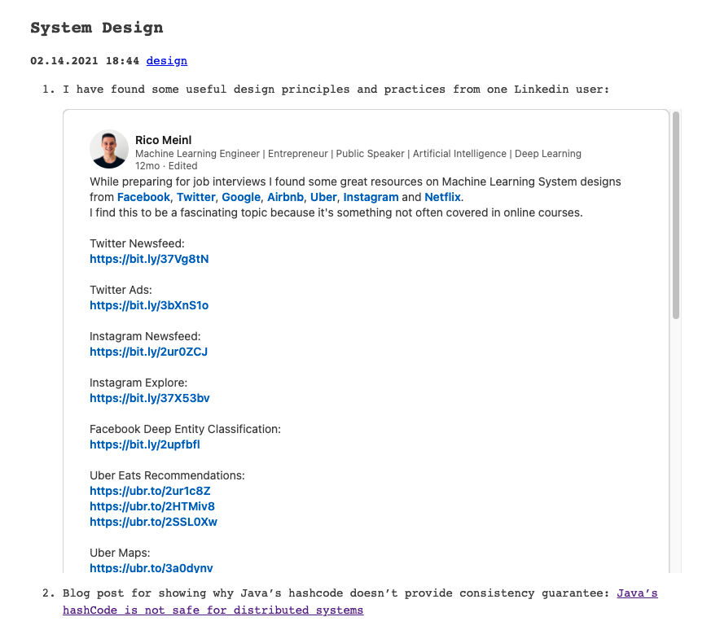

I am not a frontend guy, so it's a little challenging to me to create an aesthetical site. However, I really want to fix a bug for my linkedin shortcode on my Hugo site. Before I fix it, it looks like: 


 As you can see, the entire linkedin post is cropped, and looks very ugly. And here is what it looks like on my phone:


I have to scroll down to see the important content of this linkedin post, which is really annoying on a smaller screen.

## Responsive iframe

I know the problem is probably the shortcode, so I check what the shortcode looks like when I copy the embedded code from linkedin:

```html
<iframe src="https://www.linkedin.com/embed/feed/update/urn:li:share:6637794481066266624" height="1332" width="504" frameborder="0" allowfullscreen="" title="Embedded post"></iframe>
```

Okay, the size of the height and width is fixed, and I have to manually change them to different values everytime I link another post. It's an unpleasant  job :( I want to make it responsive.


After checking a lot of websites, I decide to use the simplest way: include a short css stylesheet to my "layouts/shortcodes/linkedin.html":

```html
<style>
.container {
  position: relative;
  overflow: hidden;
  width: 100%;
  padding-top: 75%; /* 4:3 Aspect Ratio (divide 3 by 4 = 0.75) */
}

/* Then style the iframe to fit in the container div with full height and width */
.responsive-iframe {
  position: absolute;
  top: 0;
  left: 0;
  bottom: 0;
  right: 0;
  width: 100%;
  height: 100%;
}
</style>
<div class="container">
    <iframe class="responsive-iframe" src="https://www.linkedin.com/embed/feed/update/urn:li:share:{{ index .Params 0 }}" frameborder="0" allowfullscreen="" title="Embedded post"></iframe> 
</div>
```

I got this stylesheet from [w3school](https://www.w3schools.com/howto/howto_css_responsive_iframes.asp). The `.container` means changing all the html element that is belong to "container" class to the style you have defined here. There is a another one for `.responsive-iframe`as well, which change how do you want to place the iframe in your div. Now if you check the embedded linkedin post on bigger screen:



And on your phone:


Not too bad!
