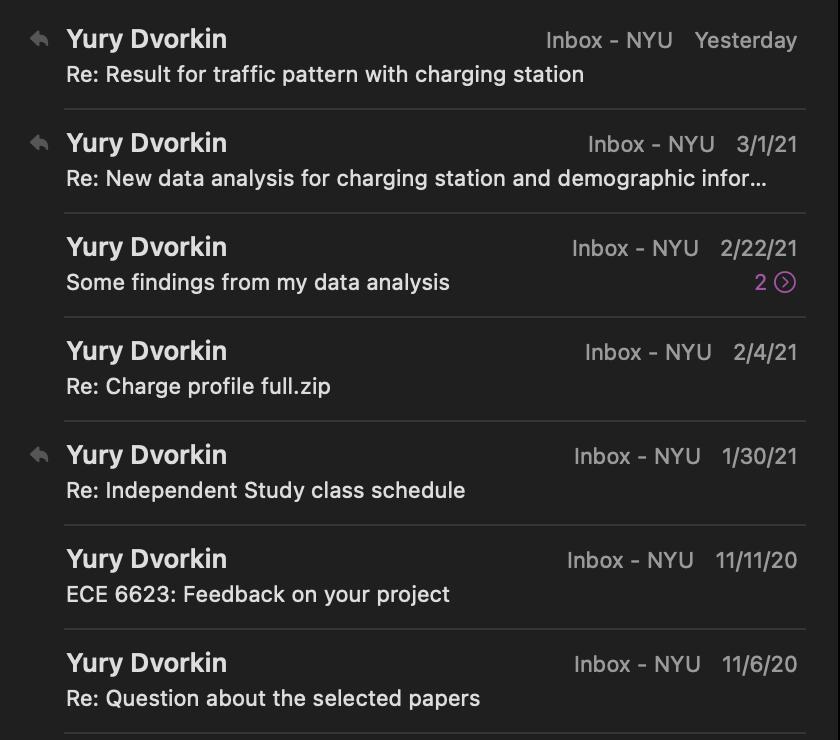
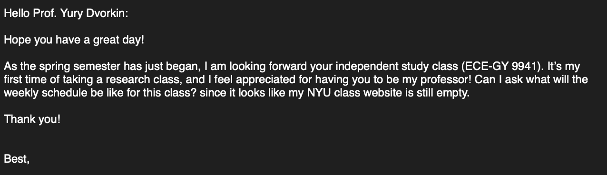
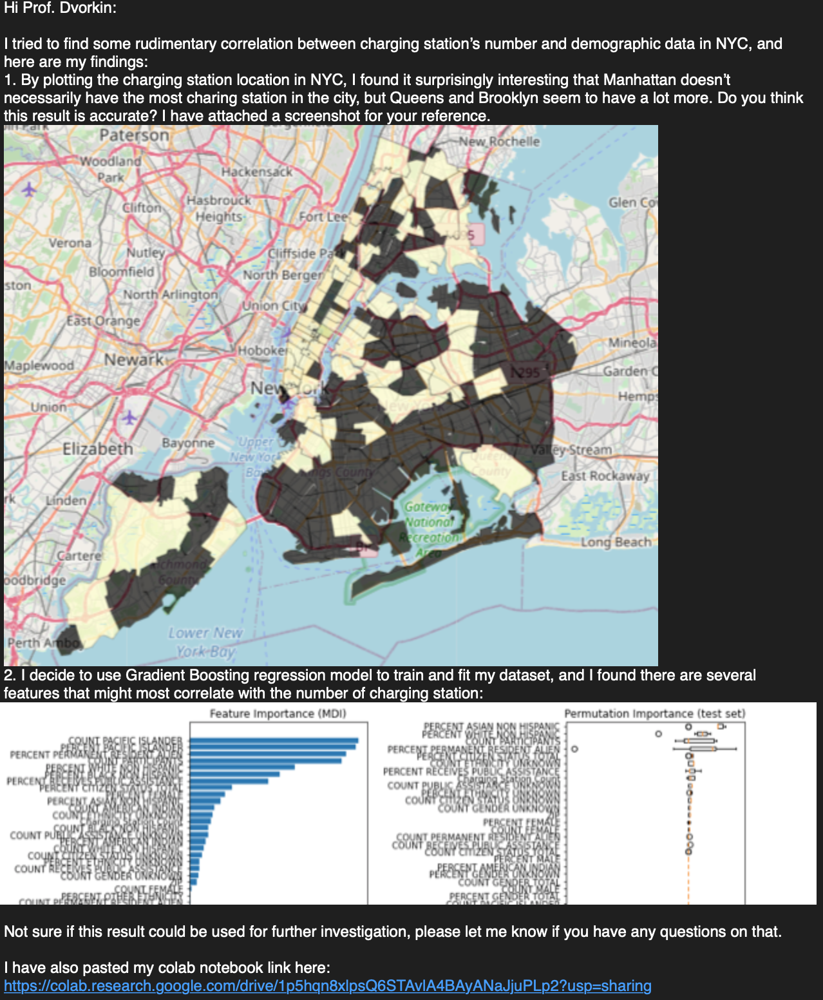

So it's my last semester of work in NYU, and I chose to take an independent study class with Prof. Yury Dvorkin. He is very busy on his research works, and I didn't really expect too much from this course (it's only 1.5 credit), so we agreed on meeting once per two weeks.

## Send everything using email isn't bad at all, it's even more efficient

In order to provide some help in case he was busy, he delegated an PhD student named Samrat supervised by him. We never met in person, since I'm remote studying in Chicago. All the communications between me and the professor will cc'd Samrat for reference. After the first meeting to introduce what I will do during the class, I have never video call with the professor again. However, I could usually keep myself busy working on something, and what's more important to me is how to craft a good email sending to both of them.

My course started on 1/30/21, and that's the first email we offically started designing the course subject/materals. After then, we kept in touch bi-weekly base.

To be honest, I was not very confident about this type of coursetaking, since I cannot see the professor and get the feedbacks immediately. However, I found the way of learning is surprisingly efficient.

To write an "efficient" email to your boss, I learnt three important things:

1. Be courteous.
2. Straight to the point.
3. Keep it short.

To anyone who can determine your future career/study, you need to be polite. Even if he/she didn't do something perfect, you cannot be rude. It's not just a trick, but more a social norm that everyone follows. 

Also keep in mind nobody would love listening you chatter without stop. Emailing is a very professional communication tool for people to talk with others, since it could be permanently saved on others' machine without your control, so it's better to keep in mind doing thing straightforward is very important.

I have mentioned my professor is qutie busy on his own studies, and we both knew it's just a 1.5 credit course, so don't waste too much time and use simple words instead of buzz words you used in your essay. Keep it in a one screen of you phone, so that he/she can read it through easily.

## Use data/image/number to tell your story

My study is about using regression model to determine the demographic information with electric charging station. I use Python notebook from Colab to do all the analysis. One good thing about it is that you can easily share your code with others without the mess of setting up environment, sending back and forth a lot of documents (or even large dataset). However, it also forces me to write actual meaningful code to produce the expected result.

Instead of using pure natural language to demnstate my idea, I choose to use data/image/number to validate my idea.

You probably won't get bored when you see this versus pure words. It indeed played well, and I could get more feedbacks from my professor.

## Conclusion

I believe it's not just in school, emailing happens in every workspace. The reason people keep using it since email service has borned is that it forces all correspondences being professional. I can even think about a lot of companies have their own email templates sending to different people (customer or their employee). There is still a long way to go for me to learn from it.