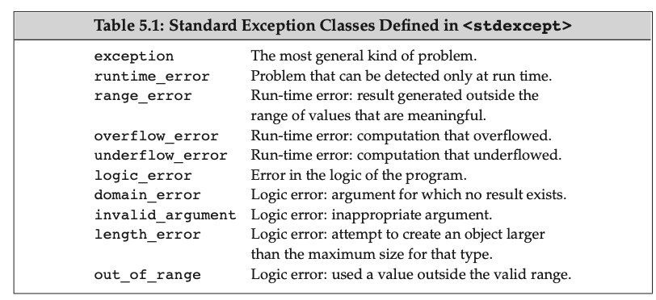

This chapter looks in detail at the statements supported by C++. *Statements* are executed sequentially. Except for the simplest programs, sequential execution is inadequate. Therefore, C++ also defines a set of **flow-of-control** statements that allow more complicated execution paths.

## Simple Statements

### Null Statements

The simplest statement is the empty statement, also known as a **null statement**. A null statement is a single semicolon: `;`. A null statement is useful where the language requires a statement but the program’s logic does not. Such usage is most common when a loop’s work can be done within its condition. For example, we might want to read an input stream, ignoring everything we read until we encounter a particular value:

```c++
// read until we hit end-of-file or find an input equal to sought
while (cin >> s && s != sought)
	; // null statement
```

### Compound Statements

Compound statements are used when the language requires a single statement but the logic of our program needs more than one. For example, the body of a while or for loop must be a single statement, yet we often need to execute more than one statement in the body of a loop. We do so by enclosing the statements in curly braces, thus turning the sequence of statements into a block. For example:

```c++
while (val <= 10) {
  sum += val;
  ++val; 
}
```

The logic of our program needed two statements but a while loop may contain only one statement. By enclosing these statements in curly braces, we made them into a single (compound) statement.

## Conditional Statements

C++ provides two statements that allow for conditional execution. The `if` statement determines the flow of control based on a condition. The `switch` statement evaluates an integral expression and chooses one of several execution paths based on the expression’s value.

### Dangling `else`

When we nest an if inside another if, it is possible that there will be **more if branches than else branches**. Indeed, our grading program has four ifs and two elses. The question arises: How do we know to which if a given else belongs? Different languages solve this problem in different ways. In C++ the ambiguity is resolved by specifying that each else is matched with the **closest preceding unmatched if**.

```c++
if (grade % 10 >= 3)
  if (grade % 10 > 7)
    	lettergrade += '+';
else
  lettergrade += '-';
```

`else` doesn't match indentation; the `else` goes with the inner `if`. What it actualy means is:

```c++
if (grade % 10 >= 3) {
  if (grade % 10 > 7)
    	lettergrade += '+';
	else
  	lettergrade += '-';
}
```

### The `switch` Statement

A switch statement executes by evaluating the parenthesized expression that follows the keyword switch. That expression may be an initialized variable declaration. The expression is converted to integral type. The result of the expression is compared with the value associated with each case.

If the expression matches the value of a `case` label, execution begins with the first statement following that label. Execution continues normally from that statement through the end of the switch or until a `break` statement.

**Multiple case stacked together**:

```c++
switch (ch) {
  // alternative legal syntax
  case 'a': case 'e': case 'i': case 'o': case 'u':
    ++vowelCnt;
    break;
}
```

**Note**: Omitting a break at the end of a case happens rarely. If you do omit a break, include a comment explaining the logic.

```c++
switch (ch) {
  case 'a':
    ++aCnt; 
  case 'e':
    ++eCnt; 
  case 'i':
    ++iCnt;  
  case 'o':
    ++oCnt;
  case 'u':
    ++uCnt;
}
```

To understand what happens, assume that the value of ch is 'e'. Execution jumps to the code following the case 'e' label, which increments eCnt. Execution *continues* across the case labels, incrementing iCnt, oCnt, and uCnt as well.

**Variable Definition inside the Body of a `switch`**: 

see [this](https://stackoverflow.com/a/19830820) for a detailed explanation of why you can't declare variables after a case label. For example:

```c++
  switch (val) {
    case VAL:
      // This won't work
      int newVal = 42;
      break;
    case ANOTHER_VAL:
      ... 
      break;
  }

```

This won't work, will throw "initialization of 'newVal' is skipped by 'case' label". A fix to this is by specifying the scope after each `case`: 

```c++
  switch (val) {
    case VAL: {
      // This won't work
      int newVal = 42;
      break;
    }
    case ANOTHER_VAL:
      ... 
      break;
  }
```

**Exercise 5.10**: There is one problem with our vowel-counting program as we’ve implemented it: It doesn’t count capital letters as vowels. Write a program that counts both lower- and uppercase letters as the appropriate vowel—that is, your program should count both ’a’ and ’A’ as part of aCnt, and so forth.

**Answer**:

```c++
#include <iostream>
using std::cin; using std::cout; using std::endl;

int main()
{
    unsigned aCnt = 0, eCnt = 0, iCnt = 0, oCnt = 0, uCnt = 0;
    char ch;
    while (cin >> ch)
        switch (ch)
        {
            case 'a':
            case 'A':
                ++aCnt;
                break;
            case 'e':
            case 'E':
                ++eCnt;
                break;
            case 'i':
            case 'I':
                ++iCnt;
                break;
            case 'o':
            case 'O':
                ++oCnt;
                break;
            case 'u':
            case 'U':
                ++uCnt;
                break;
        }
           
    cout << "Number of vowel a(A): \t" << aCnt << '\n'
         << "Number of vowel e(E): \t" << eCnt << '\n'
         << "Number of vowel i(I): \t" << iCnt << '\n'
         << "Number of vowel o(O): \t" << oCnt << '\n'
         << "Number of vowel u(U): \t" << uCnt << endl;
    
    return 0;
}
```

## Iterative Statements

Iterative statements, commonly called loops, provide for repeated execution until a condition is true. The while and for statements test the condition before executing the body. The do while executes the body and then tests its condition.

### Range `for` Statement

The new standard introduced a simpler for statement that can be used to iterate through the elements of a container or other sequence. The syntactic form of the **range** **for** **statement** is:

```
for (declaration : expression)	statement
```

*expression* must represent a sequence, such as a braced initializer list, an array, or an object of a type such as vector or string that has begin and end members that return **iterators **(chapter 4).

### The `do while` Statement

A **do while** **statement** is like a while but the condition is tested after the statement body completes. Regardless of the value of the condition, we execute the loop at least once. The syntactic form is as follows:

```
do	
	statement
while (condition);
```

**Note**: A `do while` ends with a `;` after the `()`.

## `Jump` Statements

Jump statements interrupt the flow of execution. C++ offers four jumps: break, continue, and goto, which we cover in this chapter, and the return statement, which we’ll describe in § 6.3 (p. 222).

### The `goto ` Statement

A **goto** **statement** provides an unconditional jump from the goto to a another statement in the same function.

The syntactic form of a goto statement is `goto *label*;` where *label* is an identifier that identifies a statement. A **labeled statement** is any statement that is preceded by an identifier followed by a colon:

```c++
end: return; // end is a label where goto will point to
```

The goto and the labeled statement to which it transfers control must be in the **same function**.

Jumping backward over an already executed definition is okay. The variable that has been defined before is going to be constructed again:

```c++
begin:
	int sz = get_size();
	if (sz <= 0) {
		goto begin;  
	}
```

## `try` Blocks and Exception Handling 

Exception handling supports this cooperation between the detecting and handling parts of a program. In C++, exception handling involves

* **throw** **expressions**, which the detecting part uses to indicate that it encountered something it can’t handle. We say that a throw **raises** an exception.
* **try** **blocks**, which the handling part uses to deal with an exception. A try block starts with the keyword **try** and ends with one or more **catch** **clauses**. Exceptions thrown from code executed inside a try block are usually handled by one of the catch clauses. Because they "handle" the exception, catch clauses are also known as **exception handlers**.
* A set of **exception** **classes** that are used to pass information about what happened between a throw and an associated catch.

### A `throw` Expression

The detecting part of a program uses a throw expression to raise an exception. A throw consists of the keyword throw followed by an expression. The type of the expression determines what kind of exception is thrown. A throw expression is usually followed by a semicolon, making it into an expression statement.

```c++
Sales_item item1, item2;
cin >> item1 >> item2;
// first check that item1 and item2 represent the same book 
if (item1.isbn() == item2.isbn()) {
	cout << item1 + item2 << endl;
	return 0; // indicate success 	
} else {
	cerr << "Data must refer to same ISBN" << endl;
	return -1; // indicate failure 
}
```

In a more realistic program, the part that adds the objects might be separated from the part that manages the interaction with a user. In this case, we might rewrite the test to throw an exception rather than returning an error indicator:

```c++
// first check that item1 and item2 represent the same book
if (item1.isbn() != item2.isbn()) {  
	throw runtime_error("Data must refer to the same ISBN");
}
cout << item1 + item2 << endl;
```

The type `runtime_error` is one of the standard library exception types and is defined in the `stdexcept` header. More about `runtime_error` check [cppreference.com](https://en.cppreference.com/w/cpp/error/runtime_error).

### The `try` Block

An example:

```c++
while (cin >> item1 >> item2) {  
  try {    
    // code that will add two items    
    // if the addition fails, it will throw a runtime_error exception  
  } catch (runtime_error err) {    
    cout << err.what() << "\nTry Again?" << endl;    
    char c;    
    cin >> c;    
    if (!cin || c == 'n')      
      break; // break the outter loop  
  }
}
```

If no appropriate catch is found, execution is transferred to a library function named **terminate**. The behavior of that function is system dependent but is guaranteed to stop further execution of the program. Exceptions that occur in programs that **do not define any try blocks** are handled in the same manner: After all, if there are no try blocks, there can be no handlers. If a program has no try blocks and an exception occurs, then terminate is called and the program is exited.

Here is a rule of thumb of multiple catch: [link](https://stackoverflow.com/a/2512970)

## Standard Exceptions

The C++ library defines several classes that it uses to report problems encountered in the functions in the standard library. These exception classes are also intended to be used in the programs we write. These classes are defined in four headers:

- The `exception` header defines the most general kind of exception class named `exception`. It communicates only that an exception occurred but provides no additional information.
- The `stdexcept` header defines several general-purpose exception classes, which are listed in Table 5.1.
- The new header defines the `bad_alloc` exception type, which we cover in § 12.1.2 (p. 458).
- The `type_info` header defines the `bad_cast` exception type, which we cover in § 19.2 (p. 825).



### Exercise

**Exercise 5.25:** Revise your program from the previous exercise to use a try block to catch the exception. The catch clause should print a message to the user and ask them to supply a new number and repeat the code inside the try.

```c++
#include <iostream>
#include <stdexcept>
using std::cin; using std::cout; using std::endl; using std::runtime_error;

int main(void)
{
    for (int i, j; cout << "Input two integers:\n", cin >> i >> j; )
    {
        try 
        {
            if (j == 0) 
                throw runtime_error("divisor is 0");
            cout << i / j << endl;
        }
        catch (runtime_error err) 
        {
            cout << err.what() << "\nTry again? Enter y or n" << endl;
            char c;
            cin >> c;
            if (!cin || c == 'n')
                break;
        }
    }

    return 0;
}
```

