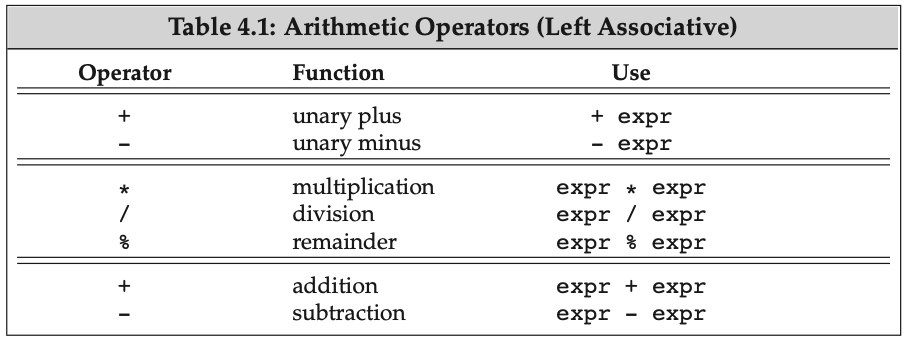
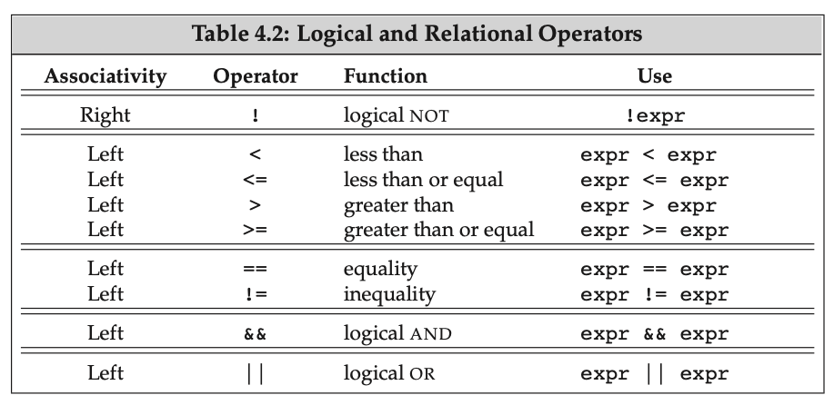
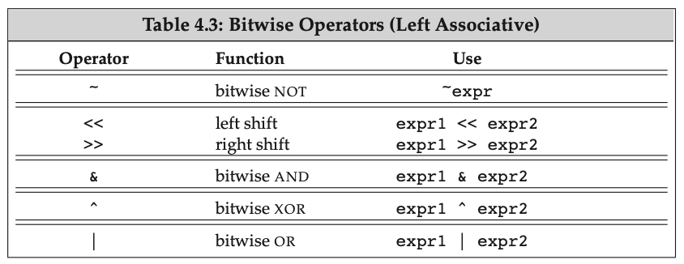
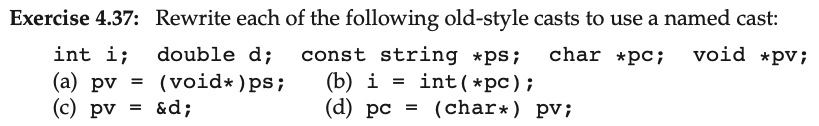

This chapter talks about *expression*, which is composed of one or more **operands** and yields **result** when it is evaluated.  The simplest form of an **expression** is a single literal or variable. The result of such an expression is the value of the variable or literal. More complicated expressions are formed from an **operator** and one or more operands.

## Fundamentals

### Precedence and Associativity 

Operands of operators with higher precedence group more tightly than operands of operators at lower precedence. Associativity determines how to group operands with the same precedence. The arithmetic operators are left associative, which means operators at the same precdence group left to right:

* Because of precedence, the expression 3+4*5 is 23, not 35. 
* Because of associativity, the expression 20-15-3 is 2, not 8.

### Order of Evaluation

For operators that do not specify evaluation order, it is an error for an expression to *refer to and change* the same object.

```c++
int i = 0;
cout << i << " " << ++i << endl; // undefined
```

Because this program is undefined, we cannot draw any conclusions about how it might behave. The compiler might evaluate ++i before evaluating i, in which case the output will be 1 1. Or the compiler might evaluate i first, in which case the output will be 0 1. *Or the compiler might do something else entirely.* Because this expression has undefined behavior, the program is in error, regardless of what code the compiler generates.

There are four operators that do guarantee the order in which operands are evaluated. We saw in § 3.2.3 (p. 94) that the logical AND (&&) operator guarantees that its left-hand operand is evaluated first. Moreover, we are also guaranteed that the right-hand operand is evaluated only if the left-hand operand is true. The only other operators that guarantee the order in which operands are evaluated are the logical OR (||) operator (§ 4.3, p. 141), the conditional (?:) operator (§ 4.7, p. 151), and the comma (,) operator (§ 4.10, p. 157).

## Arithmetic Operators



These operators are all left associative, meaning that they group left to right when the precedence levels are the same.

**A note on modulus and division operators**

The modulus operator is defined so that if m and n are integers and n is **nonzero**, then (m/n)*n + m%n is equal to m. By implication, **if m%n is nonzero, it has the same sign as m**. Earlier versions of the language permitted m%n to have the same sign as n on implementations in which negative m/n was rounded away from zero, but such implementations are now prohibited. Moreover, except for the obscure case where -m overflows, **(-m)/n and m/(-n) are always equal to -(m/n)**, **m%(-n) is equal to m%n**, **(-m)%n is equal to -(m%n)**. Division between integers returns an integer. If the quotient contains a fractional part, it is **truncated toward zero**. More concretely:

```
21%6; /* result is 3 */
21%7; /* result is 0 */ 
-21%-8; /* result is -5 */ 
21%-5; /* result is 1 */
21/6; /* result is 3 */
21/7; /* result is 3 */ 
-21/-8; /* result is 2 */ 
21/-5; /* result is -4 */
```

## Logical and Relational Operators



> list of all logical and relational operators

### Short-circuit evaluation

* The right side of an && is evaluated if and only if the left side is true.
* The right side of an || is evaluated if and only if the left side is false.

## Assignment Operators

**Multiple assignment**: each object in a multiple assignment must have the same type as its right-hand neighbor or a type to which that neighbor can be converted.

```c++
int ival, *pval; // ival is an int; pval is a pointer to int
ival = pval = 0; // error: cannot assign the value of a pointer to an int
string s1, s2;
s1 = s2 = "OK"; // string literal "OK" converted to string
int i;
double d;
d = i = 3.5; // d: 3.0, i: 3
i = d = 3.5; // d: 3.5, i: 3
```

Note the last example: Assignment is right associative.

## Increment and Decrement Operators

The prefix version avoids unnecessary work. It increments the value and returns the incremented version. The postfix operator must store the original value so that it can return the unincremented value as its result. If we don’t need the unincremented value, there’s no need for the extra work done by the postfix operator.

For `int`s and pointers, the compiler can optimize away this extra work. For more complicated iterator types, this extra work potentially might be more costly. By habitually using the prefix versions, we do not have to worry about whether the performance difference matters. Moreover—and perhaps more importantly—we can express the intent of our programs more directly.

### Combining Dereference and Increment in a Single Expression

The postfix versions of ++ and -- are used when we want to use the current value of a variable and increment it in a single compound expression.

As one example, we can use postfix increment to write a loop to print the values in a vector up to but not including the first negative value:

```c++
auto p = v.begin();
while (p != v.end())
  cout << *p++ << endl;
```

The precedence of postfix increment is higher than that of the deference operator, so `*p++` is equivalent to `*(p++)`. The statement prints the element to which pbeg originally pointed and increments pbeg. 

## The Conditional Operator

The conditional operator (the **?:** **operator**) lets us embed simple if-else logic inside an expression. The conditional operator has the following form:

```
cond ? expr1 : expr2;
```

This operator executes by evaluating *cond*. If the condition is true, then *expr1* is evaluated; otherwise, *expr2* is evaluated.

### Nesting Conditional Operations

We can nest one conditional operator inside another. That is, the conditional operator can be used as the *cond* or as one or both of the *expr*s of another conditional expression. As an example, we’ll use a pair of nested conditionals to perform a three-way test to indicate whether a grade is a high pass, an ordinary pass, or fail:

```c++
finalGrade = (grade > 90) ? "high pass" : (grade < 60) ? "fail" : "pass";
```

The conditional operator is right associative, meaning (as usual) that the operands group right to left.

### Using a Conditional Operator in an Output Expression

The conditional operator has fairly low precedence. When we embed a conditional expression in a larger expression, we usually must parenthesize the conditional subexpression. For example, we often use the conditional operator to print one or another value, depending on the result of a condition. An incompletely parenthesized conditional operator in an output expression can have surprising results:

```c++
cout << ((grade < 60) ? "fail" : "pass");  // prints pass or fail
cout << (grade < 60) ? "fail" : "pass";    // prints 1 or 0!
cout << grade < 60 ? "fail" : "pass";      // error: compares cout to 60
```

## The Bitwise Operators



**Note**: Because there are no guarantees for how the sign bit is handled, we strongly recommend using unsigned types with the bitwise operators.

The left-shift operator (the **<<** **operator**) inserts 0-valued bits on the right. The behavior of the right-shift operator (the **>>** **operator**) depends on the type of the left-hand operand: If that operand is unsigned, then the operator inserts 0-valued bits on the left; if it is a signed type, the result is implementation defined—either copies of the sign bit or 0-valued bits are inserted on the left.

The shift operators have midlevel precedence: lower than the arithmetic operators but higher than the relational, assignment, and conditional operators. These relative precedence levels mean we usually have to use parentheses to force the correct grouping of operators with lower precedence.

## The `sizeof` Operator

The `sizeof` operator returns the size, in bytes, of an expression or a type name. The operator is right associative. The result of `sizeof` is a constant expression (§ 2.4.4, p. 65) of type `size_t`. The operator takes one of two forms:

```c++
sizeof (type);
sizeof expr;
```

**What is `sizeof` to a pointer?**

- sizeof a pointer returns the size needed hold a pointer.
- sizeof a dereferenced pointer returns the size of an object of the type to which the pointer points; the pointer need not be valid.

**Other useful trick with `sizeof`:**

* sizeof an array is the size of the **entire array**. It is equivalent to taking the sizeof the element type times the number of elements in the array. Note that sizeof does not convert the array to a pointer.
* sizeof a string or a vector returns only the size of the fixed part of these types; it does not return the size used by the object’s elements.
* sizeof char or an expression of type char is guaranteed to be 1.

**So we can use `sizeof` to determine how many items are there in the array:**

```c++
constexpr size_t sz = sizeof(ia) / sizeof(*ia); // return how many items in ia array
int arr[sz];
```

## Type Conversion

### Implicit Conversions

The implicit conversions among the arithmetic types are defined to preserve precision, if possible. Most often, if an expression has both integral and floating-point operands, the integer is converted to floating-point. In this case, 3 is converted to double, floating-point addition is done, and the result is a double.

The compiler automatically converts operands in the following circumstances:

- In most expressions, values of integral types smaller than int are first promoted to an appropriate larger integral type.
- In conditions, nonbool expressions are converted to bool.
- In initializations, the initializer is converted to the type of the variable; in assignments, the right-hand operand is converted to the type of the left-hand.
- In arithmetic and relational expressions with operands of mixed types, the types are converted to a common type.
- As we’ll see in Chapter 6, conversions also happen during function calls.

### Explicit Conversions

Sometimes we want to explicitly force an object to be converted to a different type. For example, we might want to use floating-point division in the following code:

```c++
int i, j;
double slope = i / j;
```

**Although necessary at times, casts are inherently dangerous constructs.**

#### Name Casts

A named cast has the following form:

```c++
cast-name<type>(expression);
```

`static_cast`

Any well-defined type conversion, other than those involving low-level const, can be requested using a static_cast. For example, we can force our expression to use floating-point division by casting one of the operands to double:

```c++
double slope = static_cast<double>(j) / i;
```

A static_cast is often useful when a larger arithmetic type is assigned to a smaller type. The cast informs both the reader of the program and the compiler that we are aware of and are not concerned about the potential loss of precision. Compilers often generate a warning for assignments of a larger arithmetic type to a smaller type. When we do an explicit cast, the warning message is turned off.

A static_cast is also useful to perform a conversion that the compiler will not generate automatically. For example, we can use a static_cast to retrieve a pointer value that was stored in a void* pointer:

```c++
void *p = &d;
double *dp = static_cast<double*>(p);
```

`const_cast`

Remove const modifier (for low-level const:  Low-level const appears in the base type of compound types such as pointers or references):

```c++
const char *pc;
char *p = const_cast<char*>(pc);
```

But we cannot change the type of an expression:

```c++
const char *cp;
// error: static_cast can’t cast away
const char *q = static_cast<char*>(cp);
static_cast<string>(cp); // ok: converts string literal to string 
const_cast<string>(cp); // error: const_cast only changes constness
```

`reinterpret_cast`

`reinterpret_cast` only guarantees that if you cast a pointer to a different type, *and then `reinterpret_cast` it back to the original type*, you get the original value. So in the following:

```c++
int* a = new int();
void* b = reinterpret_cast<void*>(a);
int* c = reinterpret_cast<int*>(b);
```

`a` and `c` contain the same value, but the value of `b` is unspecified. (in practice it will typically contain the same address as `a` and `c`, but that's not specified in the standard, and it may not be true on machines with more complex memory systems.)

For casting to and from `void*`, `static_cast` should be preferred. Using `reinterpret_cast` is dangerous.

#### Exercise



**Answer**:

```c++
int i; double d; const string *ps; char *pc; void *pv;
pv = (void*)ps; // pv = const_cast<string*>(ps); or pv = static_cast<void*>(const_cast<string*>(ps));
i = int(*pc);   // i = static_cast<int>(*pc);
pv = &d;        // pv = static_cast<void*>(&d);
pc = (char*)pv; // pc = static_cast<char*>(pv);
```

## Terms

1. **Overload operators**: The language defines what the operators mean when applied to built-in and compound types. We can also define what most operators mean when applied to class types. Because such definitions give an alternative meaning to an existing operator symbol, we refer to them as **overloaded operators**. The IO library >> and << operators and the operators we used with strings, vectors, and iterators are all overloaded operators.
2. **operands**: Values on which an expression operates. Each operator has one or more operands associated with it.
3. **operator**: Symbol that determines what action an expression performs. The language defines a set of operators and what those operators mean when applied to values of built-in type. The language also defines the precedence and associativity of each operator and specifies how many operands each operator takes. Operators may be overloaded and applied to values of class type.
4. **Operator Precedence Table**: Refer [here](https://en.cppreference.com/w/c/language/operator_precedence)

